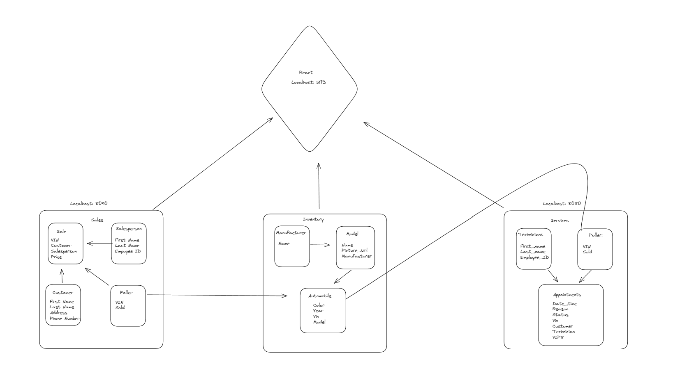

# AutoPilot

## Team as of October 2024:
* Katie

## Team as of September 2024:
* Micah - Service
* Katie - Sales

This project was initially called "CarCar" and was a class assignment. The original finished project can be found [here](https://gitlab.com/katiegory9hurrikate/project-beta)

## Pending updates:

<table>
<tr>
<th>Add/Update search/filter fields</th>
<th>Add "Create New" forms</th>
<th>Add CSV bulk upload</th>
<th>Add "Edit" & "Delete" options</th>
</tr>
<tr>
<td>
Customer List
 Salesperson List
 Salesperson History
 Service History
 Appointments List
 Technician List
 Sales History
</td>
<td>
Customer List
 Salesperson List
 Appointments List
 Technician List
 Manufacturer List
 Model List
</td>
<td>
Inventory List
 Customer List
 Appointment List
 Technician List
 Salesperson List
 Sales History
</td>
<td>
Inventory items
 Customers
 Salespeople
 Technicians
 Sales History
 Appointments
 Models
 Manufacturers
</td>
</tr>
</table>

#### Other
- [ ] Add local state filters for color groups on inventory list - this will allow vehicles to be listed with their trademarked colors but still show up in searches based on the primary color group. Ex. "Plum Crazy Purple" would show up when a user selects "Purple" as a color filter and "Pink Pizzaz" would show up when a user selects "red" as the color group filter.

- [ ] Add "Schedule Service" button to entries on the Customer List. This option will generate a modal pop-up with the New Appointment form and will auto-populate the customer's name into the Customer field.

## How to Run this App

#### Software:

- Docker Desktop (req.)
- Insomnia (or similar)
- VS Code or another code editing program
- Web Browser (Firefox or Chrome preferred)

#### Setup:

- [ ] Fork Git repository at https://github.com/katiegory9hurrikate/CarCar into your GitHub account.
- [ ] Copy the HTTP link for the forked respository from __your__ GitLab profile.
- [ ] In your terminal/command prompt on your desktop cd into the directory you want to run the project from.
- [ ] Once in the desired directory, clone the project to your computer using the `git clone` command.
- [ ] Once cloned, cd into the project-beta directory and run the following commands:
    * `docker volume create beta-data`
    * `docker compose build`
    * `docker compose up`
    * `code .`
- [ ] Familiarize yourself with the code. Use Insomnia (or similar) to test APIs. To view and test the front-end, navigate to http://localhost:5173/ using a web browser.
(note: if the docker build doesn't work for some reason, close it down, delete/prune the containers, images, and volumes and try again. The ole turn it off and back on again trick is still relevant.)

### Test Inventory
<table>
<tr>
<th>VIN</th>
<th>Color</th>
<th>Year</th>
<th>Picture URL</th>
<th>Model</th>
<th>Manufacturer</th>
</tr>
<tr>
<td>1H2BZ5FB2AN120174</td>
<td>Black</td>
<td>1967</td>
<td>https://i.imgur.com/4T9fW6w.png</td>
<td>S800</td>
<td>Honda</td>
</tr>
<tr>
<td>1V2BZ5FB2AN119714</td>
<td>Yellow</td>
<td>1971</td>
<td>https://i.imgur.com/1CBPjK9.jpeg </td>
<td>Beetle</td>
<td>Volkswagen</td>
</tr>
<tr>
<td>1V2BZ5FB2AN119744</td>
<td>Forest Green</td>
<td>1974</td>
<td>https://i.imgur.com/DKgkTU0.jpeg</td>
<td>Thing</td>
<td>Volkswagen</td>
</tr>
<tr>
<td>1P2BZ5FB2AN119674</td>
<td>Turquoise</td>
<td>1967</td>
<td>https://i.imgur.com/zRhiXru.png</td>
<td>Firebird</td>
<td>Pontiac</td>
</tr>
<tr>
<td>1F2BZ5FB2AN119824</td>
<td>Sky Blue</td>
<td>1982</td>
<td>https://i.imgur.com/oCinfqA.jpeg</td>
<td>Bronco</td>
<td>Ford</td>
</tr>
<tr>
<td>1F2BZ5FB2AN119924</td>
<td>T-Rex tax</td>
<td>1992</td>
<td>https://i.imgur.com/zS5UxwD.jpeg</td>
<td>Wrangler YJ Sahara</td>
<td>Jeep</td>
</tr>
<tr>
<td>1D2BZ5FB2AN119714</td>
<td>Plum Crazy Purple</td>
<td>1971</td>
<td>https://i.imgur.com/iGMv1oI.jpeg</td>
<td>Challenger</td>
<td>Dodge</td>
</tr>
<tr>
<td>1C0RV3TT3CV414050</td>
<td>Little Red</td>
<td>1950</td>
<td>https://i.imgur.com/INrywim.png</td>
<td>Corvette</td>
<td>Chevrolet</td>
</tr>
<tr>
<td>1C2BZ5FB2AN120174</td>
<td>Black</td>
<td>1967</td>
<td>https://i.imgur.com/JBV3t2Y.png</td>
<td>Camaro</td>
<td>Chevrolet</td>
</tr>
<tr>
<td>1C2BZ5FB2AN119594</td>
<td>Pink</td>
<td>1959</td>
<td>https://i.imgur.com/2FIlfvx.jpeg</td>
<td>Eldorado Biarritz</td>
<td>Cadillac</td>
</tr>
<tr>
<td>1D2MP5DA2RT119704</td>
<td>Lime Green</td>
<td>1970</td>
<td>https://i.imgur.com/N76nimO.jpeg</td>
<td>Dart</td>
<td>Dodge</td>
</tr>
<tr>
<td>1C2OU5GA2RM119684</td>
<td>Green</td>
<td>1968</td>
<td>https://i.imgur.com/5reIBpF.jpeg</td>
<td>Cougar</td>
<td>Mercury</td>
</tr>
<tr>
<td>1P2OR5CH2EV119654</td>
<td>Red</td>
<td>1965</td>
<td>https://i.imgur.com/FJbgFQX.jpeg</td>
<td>911</td>
<td>Porche</td>
</tr>
<tr>
<td>1P2AR5RO2WS119334</td>
<td>Silver</td>
<td>1933</td>
<td>https://i.imgur.com/A7BmIkf.png</td>
<td>Silver Arrow</td>
<td>Pierce-Arrow</td>
</tr>
<tr>
<td>1S2UP5RA2TY119954</td>
<td>Orange</td>
<td>1995</td>
<td>https://i.imgur.com/tSOKEJb.png</td>
<td>Supra</td>
<td>Toyota</td>
</tr>
<tr>
<td>1R2EB5EL2AM119704</td>
<td>White</td>
<td>1970</td>
<td>https://i.imgur.com/X0JguSM.jpeg</td>
<td>Rebel</td>
<td>AMC</td>
</tr>
</table>

## Diagram

## API Documentation
Use http://localhost:5173/ to view any adjustments made to the files on the front end. If you are on a Mac changes should automatically update in the front-end. If you are on a Windoze machine, you may need to stop and restart the containers with each change. We reccomend creating a new branch in your GitLab repository to work from if you want to make any changes to the files for commiting any updates to the original project.

### URLs and Ports
**Inventory**
 <table>
 <thead>
    <tr>
        <th> URL </th>
        <th> Method </th>
        <th> Action </th>
    </tr>
</thead>
<tbody>
    <tr>
        <td>http://localhost:8100/api/automobiles/</td>
        <td>GET</td>
        <td>List all Inventory</td>
    </tr>
    <tr>
        <td>http://localhost:8100/api/automobiles/:vin/</td>
        <td>GET</td>
        <td>Show details for specific inventory item</td>
    </tr>
    <tr>
        <td>http://localhost:8100/api/automobiles/</td>
        <td>POST</td>
        <td>Create new inventory item</td>
    </tr>
    <tr>
        <td>http://localhost:8100/api/automobiles/:vin/</td>
        <td>PUT</td>
        <td>Update a specific inventory item</td>
    </tr>
    <tr>
        <td>http://localhost:8100/api/automobiles/:vin/</td>
        <td>DELETE</td>
        <td>Remove a specific inventory item</td>
    </tr>
</tbody>
</table>

**Manufacturers**
 <table>
 <thead>
    <tr>
        <th> URL </th>
        <th> Method </th>
        <th> Action </th>
    </tr>
</thead>
<tbody>
    <tr>
        <td>http://localhost:8100/api/manufacturers/</td>
        <td>GET</td>
        <td>List all Manufacturers</td>
    </tr>
    <tr>
        <td>http://localhost:8100/api/manufacturers/:id/</td>
        <td>GET</td>
        <td>Show a specific manufacturer</td>
    </tr>
    <tr>
        <td>http://localhost:8100/api/manufacturers/</td>
        <td>POST</td>
        <td>Create new manufacturer</td>
    </tr>
    <tr>
        <td>http://localhost:8100/api/manufacturers/:id/</td>
        <td>PUT</td>
        <td>Update a specific manufacturer</td>
    </tr>
    <tr>
        <td>http://localhost:8100/api/manufacturers/:id/</td>
        <td>DELETE</td>
        <td>Remove a specific manufacturer</td>
    </tr>
</tbody>
</table>

**Models**
 <table>
 <thead>
    <tr>
        <th> URL </th>
        <th> Method </th>
        <th> Action </th>
    </tr>
</thead>
<tbody>
    <tr>
        <td>http://localhost:8100/api/models/</td>
        <td>GET</td>
        <td>List all models</td>
    </tr>
    <tr>
        <td>http://localhost:8100/api/models/:id/</td>
        <td>GET</td>
        <td>Show details of a specific model</td>
    </tr>
    <tr>
        <td>http://localhost:8100/api/models/</td>
        <td>POST</td>
        <td>Create new model</td>
    </tr>
    <tr>
        <td>http://localhost:8100/api/models/:id/</td>
        <td>PUT</td>
        <td>Update a specific model</td>
    </tr>
    <tr>
        <td>http://localhost:8100/api/models/:id/</td>
        <td>DELETE</td>
        <td>Remove a specific model</td>
    </tr>
</tbody>
</table>

**Sales**
 <table>
 <thead>
    <tr>
        <th> URL </th>
        <th> Method </th>
        <th> Action </th>
    </tr>
</thead>
<tbody>
    <tr>
        <td>http://localhost:8090/api/sales/</td>
        <td>GET</td>
        <td>List all sales</td>
    </tr>
    <tr>
        <td>http://localhost:8090/api/sales/:id/</td>
        <td>GET</td>
        <td>Get a specific sale</td>
    </tr>
    <tr>
        <td>http://localhost:8090/api/sales/</td>
        <td>POST</td>
        <td>Create new sale</td>
    </tr>
    <tr>
        <td>http://localhost:8090/api/sales/:id/</td>
        <td>PUT</td>
        <td>Update a specific sale</td>
    </tr>
    <tr>
        <td>http://localhost:8090/api/sales/:id/</td>
        <td>DELETE</td>
        <td>Remove a specific sale</td>
    </tr>
</tbody>
</table>

**Salespeople**
 <table>
 <thead>
    <tr>
        <th> URL </th>
        <th> Method </th>
        <th> Action </th>
    </tr>
</thead>
<tbody>
    <tr>
        <td>http://localhost:8090/api/salespeople/</td>
        <td>GET</td>
        <td>List all salespeople</td>
    </tr>
    <tr>
        <td>http://localhost:8090/api/salespeople/:id/</td>
        <td>GET</td>
        <td>Get a specific salesperson</td>
    </tr>
    <tr>
        <td>http://localhost:8090/api/salespeople/</td>
        <td>POST</td>
        <td>Create new salesperson</td>
    </tr>
    <tr>
        <td>http://localhost:8090/api/salespeople/:id/</td>
        <td>PUT</td>
        <td>Update a specific salesperson</td>
    </tr>
    <tr>
        <td>http://localhost:8090/api/salespeople/:id/</td>
        <td>DELETE</td>
        <td>Remove a specific salesperson</td>
    </tr>
</tbody>
</table>

**Customers**
 <table>
 <thead>
    <tr>
        <th> URL </th>
        <th> Method </th>
        <th> Action </th>
    </tr>
</thead>
<tbody>
    <tr>
        <td>http://localhost:8090/api/customers/</td>
        <td>GET</td>
        <td>List all customers</td>
    </tr>
    <tr>
        <td>http://localhost:8090/api/customers/:id/</td>
        <td>GET</td>
        <td>Get a specific customer</td>
    </tr>
    <tr>
        <td>http://localhost:8090/api/customers/</td>
        <td>POST</td>
        <td>Create new customer</td>
    </tr>
    <tr>
        <td>http://localhost:8090/api/customers/:id/</td>
        <td>PUT</td>
        <td>Update a specific customer</td>
    </tr>
    <tr>
        <td>http://localhost:8090/api/customers/:id/</td>
        <td>DELETE</td>
        <td>Remove a specific customer</td>
    </tr>
</tbody>
</table>

**Service Appointments**
 <table>
 <thead>
    <tr>
        <th> URL </th>
        <th> Method </th>
        <th> Action </th>
    </tr>
</thead>
<tbody>
    <tr>
        <td>http://localhost:8080/api/appointments/</td>
        <td>GET</td>
        <td>List all appointments</td>
    </tr>
    <tr>
        <td>http://localhost:8080/api/appointments/</td>
        <td>POST</td>
        <td>Create new appointment</td>
    </tr>
    <tr>
        <td>http://localhost:8080/api/appointments/:id/cancel/</td>
        <td>PUT</td>
        <td>Update a specific appointment status to "cancelled"</td>
    </tr>
    <tr>
        <td>http://localhost:8100/api/manufacturers/:id/finish/</td>
        <td>PUT</td>
        <td>Update a specific appointment status to "finished"</td>
    </tr>
    <tr>
        <td>http://localhost:8100/api/manufacturers/:id/</td>
        <td>DELETE</td>
        <td>Remove a specific appointment</td>
    </tr>
</tbody>
</table>

**Technicians**
 <table>
 <thead>
    <tr>
        <th> URL </th>
        <th> Method </th>
        <th> Action </th>
    </tr>
</thead>
<tbody>
    <tr>
        <td>http://localhost:8080/api/technicians</td>
        <td>GET</td>
        <td>List all technicians</td>
    </tr>
    <tr>
        <td>http://localhost:8080/api/technicians/:id/</td>
        <td>GET</td>
        <td>Get a specific technician</td>
    </tr>
    <tr>
        <td>http://localhost:8080/api/technicians/</td>
        <td>POST</td>
        <td>Create new technician</td>
    </tr>
    <tr>
        <td>http://localhost:8080/api/technicians/:id/</td>
        <td>PUT</td>
        <td>Update a specific technician</td>
    </tr>
    <tr>
        <td>http://localhost:8080/api/technicians/:id/</td>
        <td>DELETE</td>
        <td>Remove a specific technician</td>
    </tr>
</tbody>
</table>

## Value Objects
| AutomobileVO | Used to identify Vehicles in Inventory via their VIN (Vehicle Identification Number) and their sold/unsold status |

## Inventory microservice

* Initial API for the CarCar application that holds a database for the Sales and Service microservices to work with. Its key components are:

 <table>
 <thead>
    <tr>
        <th> VIEWS </th>
        <th> MODELS </th>
        <th> ENCODERS </th>
    </tr>
</thead>
 <tbody>
    <tr>
        <td>
        api_automobiles 
        api_automobile 
        api_manufacturers 
        api_manufacturer 
        api_vehicle_models 
        api_vehicle_model
        </td>
        <td>
        Manufacturer 
        VehicleModel 
        Automobile
        </td>
        <td>
        ManufacturerEncoder 
        VehicleModelEncoder 
        AutomobileEncoder
        </td>
    </tr>
 </tbody>
 </table>

## Service microservice

* This API allows connects to the Inventory API in order to identify Service customers that have purchased a vehicle through the dealership via the VIN of the vehicle they have brought in to be serviced. Its key components are:

 <table>
 <thead>
    <tr>
        <th> VIEWS </th>
        <th> MODELS </th>
        <th> ENCODERS </th>
    </tr>
</thead>
 <tbody>
    <tr>
        <td>
        api_list_technicians 
        api_delete_technician 
        api_list_appointments 
        api_delete_appointment 
        api_finish_apppointment 
        api_cancel_appointment
        </td>
        <td>
        Technician 
        AutomobileVO 
        Appointment
        </td>
        <td>
        TechnicianEncoder 
        AppointmentEncoder 
        AutomobileVOEncoder
        </td>
    </tr>
 </tbody>
 </table>

## Sales microservice

* This API allows connects to the Inventory API in order to sell vehicles in inventory and connect those sales to customers and salespeople. This also allows customers to be identified as VIPs in the Service API when a vehicle is marked as sold. Its key components are:

 <table>
 <thead>
    <tr>
        <th> VIEWS </th>
        <th> MODELS </th>
        <th> ENCODERS </th>
    </tr>
</thead>
 <tbody>
    <tr>
        <td>
        api_list_salespeople 
        api_show_salesperson 
        api_list_customers 
        api_show_customer 
        api_list_sales 
        api_show_sale
        </td>
        <td>
        Salesperson 
        Customer 
        Sale 
        AutomobileVO
        </td>
        <td>
        SalespersonEncoder 
        CustomerEncoder 
        SalesDetailEncoder 
        AutomobileVOEncoder
        </td>
    </tr>
 </tbody>
 </table>
